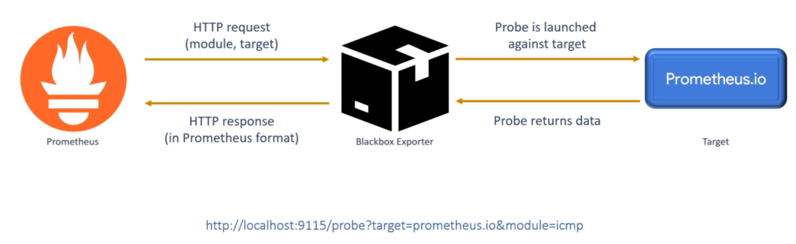

  <h1 align="center">Blackbox Exporter Prometheus Detection tool</h1>
  

    <a href="README.md"><strong>English</strong></a> | <strong>简体中文</strong>
  

## Table of Contents

- [Repository Introduction](#repository-introduction)
- [Prerequisites](#prerequisites)
- [Image Specifications](#image-specifications)
- [Getting Help](#getting-help)
- [How to Contribute](#how-to-contribute)

## Repository Introduction
‌[Blackbox Exporter‌](https://github.com/prometheus/blackbox_exporter) The Blackbox Exporter is an active probing tool within the Prometheus ecosystem, designed to monitor the availability of external services by simulating client requests. It supports detection through various protocols including HTTP/HTTPS, TCP, ICMP, and DNS.

**Core Features:**
1. Multi-Protocol Detection Capability: The core functionality of Blackbox Exporter is to support probing external targets through various network protocols. This primarily includes HTTP(S), TCP, ICMP (Ping), DNS, and UDP (via ICMP echo). For instance, it can simulate user access to check the availability, response time, and content correctness of web services.
2. Flexible Probe Configuration: Multiple probe modules (Modules) are defined through a configuration file (blackbox.yml), with each module independently configurable for probe parameters. For example, setting TLS verification rules, custom request headers, timeouts, IP protocol versions (IPv4/IPv6), and redirect following behavior for HTTP probes.
3. Deep HTTP Inspection: Provides a rich set of inspection dimensions for HTTP(S) services, far beyond simple port connectivity. It can verify status codes (e.g., expect: status_code == 200), response body content (via regex matching expect: body contains 'uccess'), response headers, and the validity and chain integrity of SSL/TLS certificates.
4. Probe-Based Pull Model: Blackbox Exporter does not actively probe; its working mode is that the Prometheus Server initiates pull requests via HTTP, carrying parameters to specify the probe target and module. This design seamlessly integrates it into Prometheus's pull ecosystem, with Prometheus uniformly managing the pull cycle and service discovery.
5. Exposure of Standardized Monitoring Metrics: After each probe, a set of well-formatted and clearly defined Prometheus metrics is returned. Core metrics include probe_success (success or failure), probe_duration_seconds (probe duration), probe_http_status_code (HTTP status code), and protocol-specific metrics (e.g., probe_ssl_earliest_cert_expiry), facilitating querying and alerting via PromQL.
6. Integrated Service Discovery: Seamlessly collaborates with Prometheus, utilizing Prometheus's native service discovery mechanisms (such as Kubernetes, Consul, DNS SRV records, etc.) to dynamically obtain the list of targets to be probed. Automatic updates of monitoring targets can be achieved without manually modifying Blackbox Exporter configurations.
7. Bridge Between White-box and Black-box Monitoring: It is a key component connecting white-box monitoring (internal application metrics) with black-box monitoring (external user experience). By simulating external customer interactions, it provides a comprehensive view of both internal and external perspectives of the application.

This project offers pre-configured [**`Blackbox Exporter-Prometheus Detection tool`**]()，images with Blackbox Exporter and its runtime environment pre-installed, along with deployment templates. Follow the guide to enjoy an "out-of-the-box" experience.

**Architecture Design:**

> **System Requirements:**
> - CPU: 4vCPUs or higher
> - RAM: 16GB or more
> - Disk: At least 50GB

## Prerequisites
[Register a Huawei account and activate Huawei Cloud](https://support.huaweicloud.com/usermanual-account/account_id_001.html)

## Image Specifications

| Image Version          | Description | Notes |
|------------------------| --- | --- |
| [BlackboxExporter0.27.0-kunpeng-v1.0](https://github.com/HuaweiCloudDeveloper/prometheus-blackbox-exporter-image/tree/BlackboxExporter0.27.0-kunpeng-v1.0?tab=readme-ov-file) | Deployed on Kunpeng servers with Huawei Cloud EulerOS 2.0 64bit |  |

## Getting Help
- Submit an [issue](https://github.com/HuaweiCloudDeveloper/prometheus-blackbox-exporter-image/issues)
- Contact Huawei Cloud Marketplace product support

## How to Contribute
- Fork this repository and submit a merge request.
- Update README.md synchronously based on your open-source mirror information.