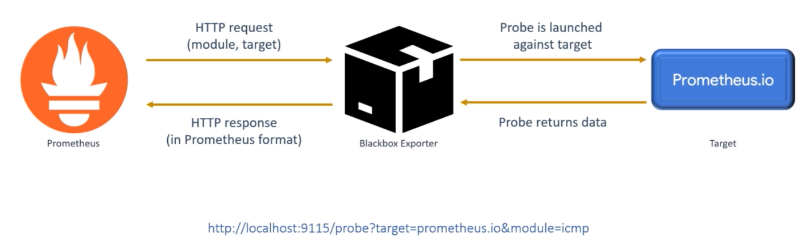

  <h1 align="center">Blackbox Exporter Prometheus探测工具</h1>
  

    <a href="README.md"><strong>English</strong></a> | <strong>简体中文</strong>
  

## 目录

- [仓库简介](#项目介绍)
- [前置条件](#前置条件)
- [镜像说明](#镜像说明)
- [获取帮助](#获取帮助)
- [如何贡献](#如何贡献)

## 项目介绍
‌[Blackbox Exporter‌](https://github.com/prometheus/blackbox_exporter) Blackbox Exporter 是 Prometheus 生态中的主动探测工具，通过模拟客户端请求监控外部服务的可用性，支持 HTTP/HTTPS、TCP、ICMP、DNS 等多种协议检测‌。

**核心特性：**
1. 多协议探测能力：Blackbox Exporter 核心功能是支持通过多种网络协议对外部目标进行探测。主要包括 HTTP(S)、TCP、ICMP (Ping)、DNS 以及 UDP（通过 ICMP 回显）。例如，它可以模拟用户访问来检测 Web 服务的可用性、响应时间和内容正确性。
2. 灵活的探测定配置：通过配置文件 (blackbox.yml) 定义多种探测模块（Module），每个模块可独立配置探测参数。例如，为 HTTP 探测设置 TLS 验证规则、自定义请求头、超时时间、IP 协议版本（IPv4/IPv6）以及跟随重定向行为。
3. 深度 HTTP 检查：对 HTTP(S) 服务提供丰富的检查维度，远超简单的端口连通性。可验证状态码（如 expect: status_code == 200）、响应体内容（通过正则表达式匹配 expect: body contains 'success'）、响应头信息以及 SSL/TLS 证书的有效期和链的完整性。
4. 基于探针的拉取模型：Blackbox Exporter 本身并不主动探测，其工作模式是 Prometheus Server 通过 HTTP 接口向其发起抓取请求，并携带参数指定探测目标和模块。这种设计使其完美融入 Prometheus 的拉取生态系统，由 Prometheus 统一管理抓取周期和服务发现。
5. 暴露标准化的监控指标： 每次探测结束后，会返回一组格式规范、含义明确的 Prometheus 指标。核心指标包括 probe_success（成功与否）、probe_duration_seconds（探测耗时）、probe_http_status_code（HTTP状态码）以及各协议特有的指标（如 probe_ssl_earliest_cert_expiry），方便通过 PromQL 进行查询和告警。
6. 集成服务发现：与 Prometheus 无缝协作，可利用 Prometheus 的原生服务发现机制（如 Kubernetes, Consul, DNS SRV 记录等）动态获取需要探测的目标列表。无需手动修改 Blackbox Exporter 配置，即可实现监控目标的自动更新。
7. 黑白盒监控桥梁：它是连接白盒监控（应用内部指标）与黑盒监控（外部用户体验）的关键组件。通过模拟外部客户的行为，从终端用户视角监控服务的健康状态、性能和可用性，提供了内部指标无法反映的业务层面洞察。

本项目提供的开源镜像商品 [**`Blackbox Exporter-Prometheus探测工具`**]()，已预先安装 Blackbox Exporter 软件及其相关运行环境，并提供部署模板。快来参照使用指南，轻松开启“开箱即用”的高效体验吧。

**架构设计：**

> **系统要求如下：**
> - CPU: 4vCPUs 或更高
> - RAM: 16GB 或更大
> - Disk: 至少 50GB

## 前置条件
[注册华为账号并开通华为云](https://support.huaweicloud.com/usermanual-account/account_id_001.html)

## 镜像说明

| 镜像规格                                                                                                                                                                          | 特性说明 | 备注 |
|-------------------------------------------------------------------------------------------------------------------------------------------------------------------------------| --- | --- |
| [BlackboxExporter0.27.0-kunpeng-v1.0](https://github.com/HuaweiCloudDeveloper/prometheus-blackbox-exporter-image/tree/BlackboxExporter0.27.0-kunpeng-v1.0?tab=readme-ov-file) | 基于鲲鹏服务器 + Huawei Cloud EulerOS 2.0 64bit 安装部署 |  |

## 获取帮助
- 更多问题可通过 [issue](https://github.com/HuaweiCloudDeveloper/prometheus-blackbox-exporter-image/issues) 或 华为云云商店指定商品的服务支持 与我们取得联系
- 其他开源镜像可看 [open-source-image-repos](https://github.com/HuaweiCloudDeveloper/open-source-image-repos)

## 如何贡献
- Fork 此存储库并提交合并请求
- 基于您的开源镜像信息同步更新 README.md